# Diagrama de Caso de Uso - ReserTable

Este documento presenta el diagrama de caso de uso para el sistema de gestión de restaurantes ReserTable, mostrando las interacciones entre los diferentes actores y el sistema.

## Diagrama

```mermaid
flowchart TD
    %% Definición de actores
    classDef actorClass fill:#f9f,stroke:#333,stroke-width:2px
    
    subgraph Cliente
        CU1[Registrarse]
        CU2[Iniciar sesión]
        CU3[Reservar mesa]
        CU4[Ver historial de reservas]
        CU5[Usar código de descuento]
        CU6[Ver historial de consumo]
    end
    
    subgraph Empleado
        CU7[Gestionar pedidos]
        CU8[Procesar reservas]
        CU9[Gestionar mesas]
        CU10[Consultar inventario]
    end
    
    subgraph Administrador
        CU11[Gestionar usuarios]
        CU12[Configurar mesas]
        CU13[Crear códigos de descuento]
        CU14[Gestionar menú]
        CU15[Administrar inventario]
        CU16[Gestionar alérgenos]
    end
    
    %% Relaciones - Cliente
    Cliente --> CU1
    Cliente --> CU2
    Cliente --> CU3
    Cliente --> CU4
    Cliente --> CU5
    Cliente --> CU6
    
    %% Relaciones - Empleado
    Empleado --> CU2
    Empleado --> CU7
    Empleado --> CU8
    Empleado --> CU9
    Empleado --> CU10
    
    %% Relaciones - Administrador
    Administrador --> CU2
    Administrador --> CU11
    Administrador --> CU12
    Administrador --> CU13
    Administrador --> CU14
    Administrador --> CU15
    Administrador --> CU16
    
    %% Relaciones de inclusión/extensión
    CU3 -.-> |<<include>>| CU9
    CU7 -.-> |<<include>>| CU10
    CU14 -.-> |<<include>>| CU16
```

## Descripción de Actores

### Cliente
Persona que utiliza el sistema para realizar reservas, consultar su historial y utilizar beneficios como códigos de descuento.

### Empleado
Personal del restaurante que gestiona las operaciones diarias como procesar reservas, gestionar pedidos y consultar el inventario.

### Administrador
Persona con privilegios completos para gestionar todos los aspectos del sistema, incluyendo la configuración de mesas, gestión de usuarios y creación de códigos de descuento.

## Descripción de Casos de Uso

### Módulo Cliente
- **Registrarse**: Permite a un nuevo cliente crear una cuenta en el sistema.
- **Iniciar sesión**: Permite a los usuarios autenticarse en el sistema.
- **Reservar mesa**: Permite al cliente reservar una mesa específica en una fecha y hora determinadas.
- **Ver historial de reservas**: Permite al cliente consultar sus reservas anteriores y actuales.
- **Usar código de descuento**: Permite al cliente aplicar un código de descuento a su reserva o pedido.
- **Ver historial de consumo**: Permite al cliente ver un registro de sus consumos anteriores.

### Módulo Empleado
- **Gestionar pedidos**: Permite al empleado crear, modificar y dar seguimiento a los pedidos.
- **Procesar reservas**: Permite al empleado confirmar, modificar o cancelar reservas.
- **Gestionar mesas**: Permite al empleado asignar mesas según disponibilidad.
- **Consultar inventario**: Permite al empleado verificar la disponibilidad de ingredientes.

### Módulo Administrador
- **Gestionar usuarios**: Permite al administrador crear, modificar y eliminar cuentas de usuario.
- **Configurar mesas**: Permite al administrador definir la disposición y capacidad de las mesas.
- **Crear códigos de descuento**: Permite al administrador generar códigos de descuento globales o personalizados.
- **Gestionar menú**: Permite al administrador añadir, modificar o eliminar productos del menú.
- **Administrar inventario**: Permite al administrador gestionar el stock de ingredientes.
- **Gestionar alérgenos**: Permite al administrador definir y asignar alérgenos a los productos según la normativa.
